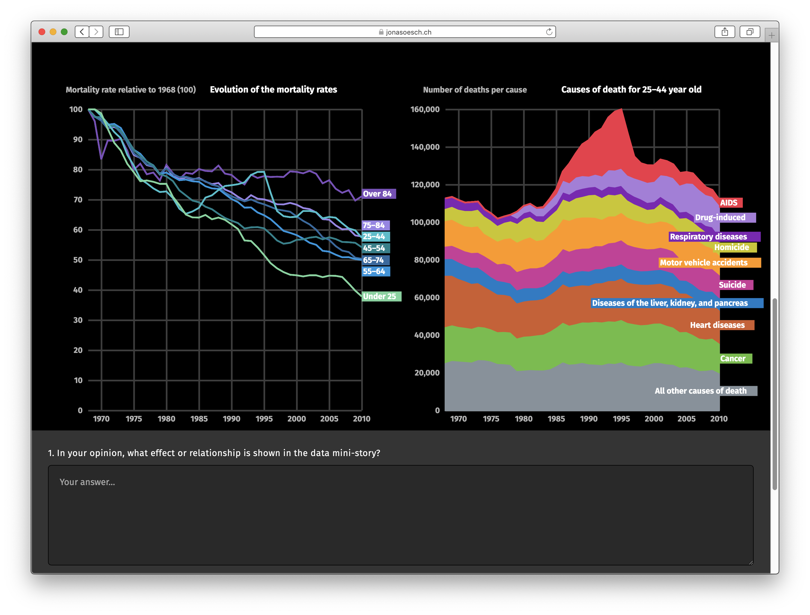

# Redesigning the Bloomberg story on "How Americans Die"

The [original story](https://www.bloomberg.com/graphics/dataview/how-americans-die/) is a beautiful example of storytelling through visualizations. The authors use a lot of animations to transition from one visualization to the next. This project intends to address some of the problems found in the transitions and to test what works best with users in order to explore design principles for animated transitions.



## Structure of the project

The project explores the effects of different styles of animated and non-animated transitions of reader. We call these scenarios:

|                | Measure walk | Measure walk | Dialogue |
| -------------- | ------------ | ------------ | -------- |
| **Juxtaposed** |              |              |          |
| static         | JSA          | JSR          | JSC      |
| animated       | JAA          | JAR          | JAC      |
| **Superposed** |              |              |          |
| static         | SSA          | SSR          | SSC      |
| animated       | SSA          | SAR          | SAC      |

Each of the four different scenarios can be found in a separate branch: `juxtaposed-static`, `juxtaposed-animated`, `superposed-static`, `superposed-animated`. The master branch is used to develop their common core and is mainly based on the "superposed-animated" scenario.

For each of the four scenarios, the same experiments have been implemented as separate websites. They can be found in the `static` folder.

The code to make it all work as well as the tests can be found in `src`. the structure of includes is as follows:


## Installation

The visualization was developed with Typescript and d3. It also requires Python 3 and Flask to provide the API-backend to test the logger. But this is not essential.


1. Clone the repository:

```bash
git clone https://github.com/jonasoesch/mortality
```

2. Change into the folder:

```bash
cd mortality
```

3. Install the required node modules:

```bash
npm install
```

4. Run the Typescript server. The project is now available on http://localhost:8080/

```
npm run start
```

### Installation of the logger

1. Change into the `logger` directory

```bash
cd logger
```

2. Install the required python3 libraries

```bash
pip install -r requirements.txt
```


3. Run the webserver providing the API

```bash
FLASK_APP=start.py flask run
```

