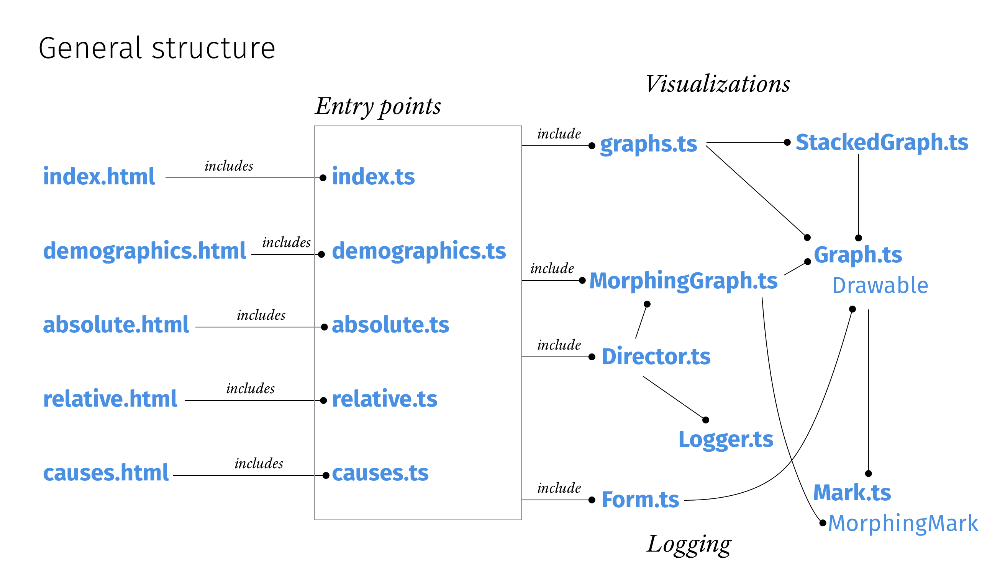

# Redesigning «How Americans Die»

The [original story](https://www.bloomberg.com/graphics/dataview/how-americans-die/) is a beautiful example of storytelling through visualizations. The authors use a lot of animations to transition from one visualization to the next. This project intends to address some of the problems found in the transitions and to test what works best with users in order to explore design principles for animated transitions.


## Structure of the project

The project explores the effects of different styles of animated and non-animated transitions of the reader. We call these scenarios:

|                | Measure walk | Measure walk | Dialogue |
| -------------- | ------------ | ------------ | -------- |
| **Juxtaposed** |              |              |          |
| static         | JSA          | JSR          | JSC      |
| animated       | JAA          | JAR          | JAC      |
| **Superposed** |              |              |          |
| static         | SSA          | SSR          | SSC      |
| animated       | SSA          | SAR          | SAC      |

Each of the four different scenarios can be found in a separate branch: `juxtaposed-static`, `juxtaposed-animated`, `superposed-static`, `superposed-animated`. The master branch is used to develop their common core and is mainly based on the "superposed-animated" scenario.

For each of the four scenarios, the same experiments have been implemented as separate websites. They can be found in the `static` folder.

The code to make it all work as well as the tests can be found in `src`. the general structure is as follows:



This overview presents only the most important classes and files and omits some smaller ones for clarity. The general principle is as follows: Each entry point includes the visualizations it needs to render from `graphs.ts`. It creates instances of `MorphingGraph` to connect the graphs via animated transitions where necessary. In cases where staged animation is used, it derives a new visualization from one of the included visualizations. A new instance of `Director` is then created to define the sequence of visualizations. The minimum requirements for a valid visualization are defined in the `Drawable` interface. But typically, visualizations are derived from the `Graph` class. 

The questionnaire at the end of each experiment is also controlled through the director and adheres to the `Drawable` interface.

Finally, the director includes a logger that is called each time a visualization is redrawn.

## Installation

The visualization was developed with Typescript and d3. It also requires Python 3 and Flask to provide the API-backend to test the logger. But this is not essential.


1. Clone the repository:

```bash
git clone https://github.com/jonasoesch/mortality
```

2. Change into the folder:

```bash
cd mortality
```

3. Install the required node modules:

```bash
npm install
```

4. Run the Typescript server. The project is now available on http://localhost:8080/

```
npm run start
```

### Installing the logger

1. Change into the `logger` directory

```bash
cd logger
```

2. Install the required python3 libraries

```bash
pip install -r requirements.txt
```


3. Run the web server providing the API.

```bash
FLASK_APP=start.py python3 -m flask run
```


## Logger

The logger can be found in the `logger`-directory. The `start.py`-file implements two API-Endpoints `/` and `/form`. `/` is used to send records of the readers' scrolling behavior on each draw.  The records are saved as CSV-files into the `logs`-directory. `/form` is used to store participants answers to the survey at the end of each experiment. The responses are stored as CSV-files in the `responses`-directory.

The logger contains a preliminary analysis in `log-analysis.ipynb`-file in the `analysis`-directory. To run the analysis, you need [JupyterLab](https://jupyterlab.readthedocs.io/en/stable/) (which should already have been installed when installing the logger). Run

```bash
jupyter lab
```

To open a browser window and access the  `log-analysis.ipynb`-file as well as the different visualizations (the files ending in `.vl`).

## Tests

The project comes with a set of tests (which are by no means complete). Tests have the same name as the classes they test with an extension of `.spec.ts`. They can be run like this:

```bash
npm run test
```


## Documentation

The documentation generated from the source can be accessed in the `docs`-folder.
