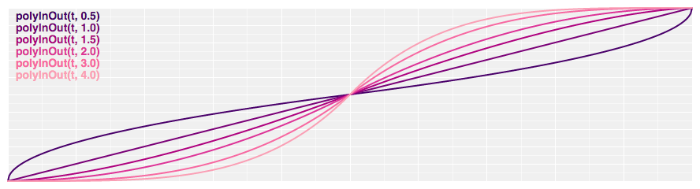
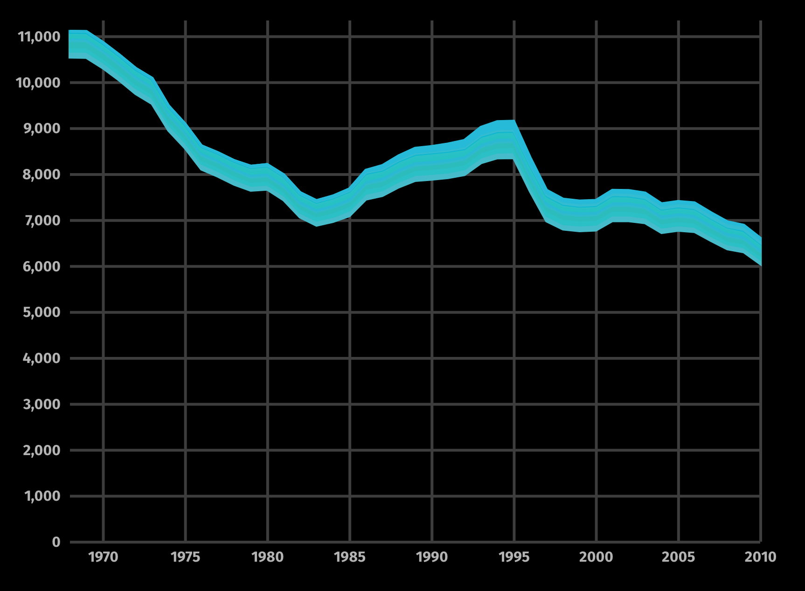
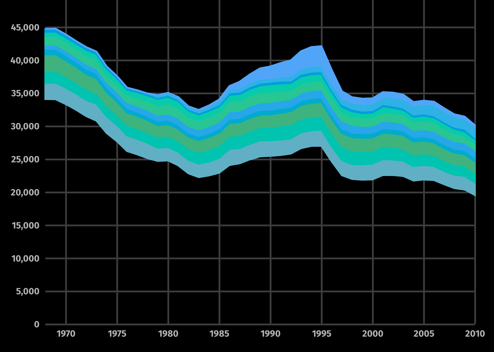
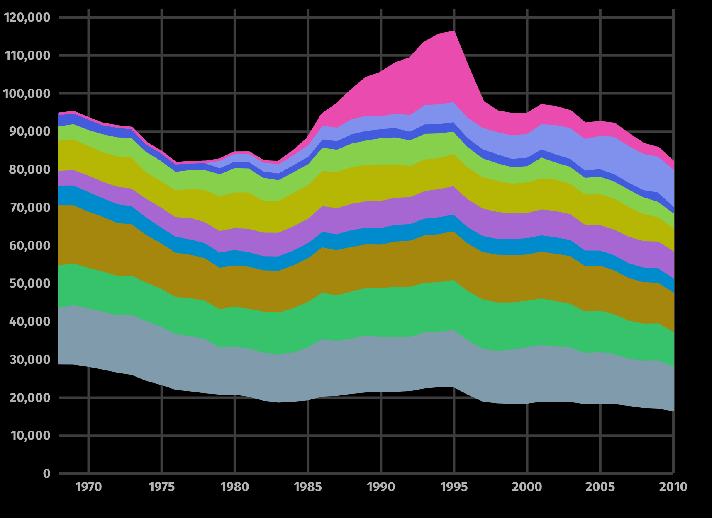
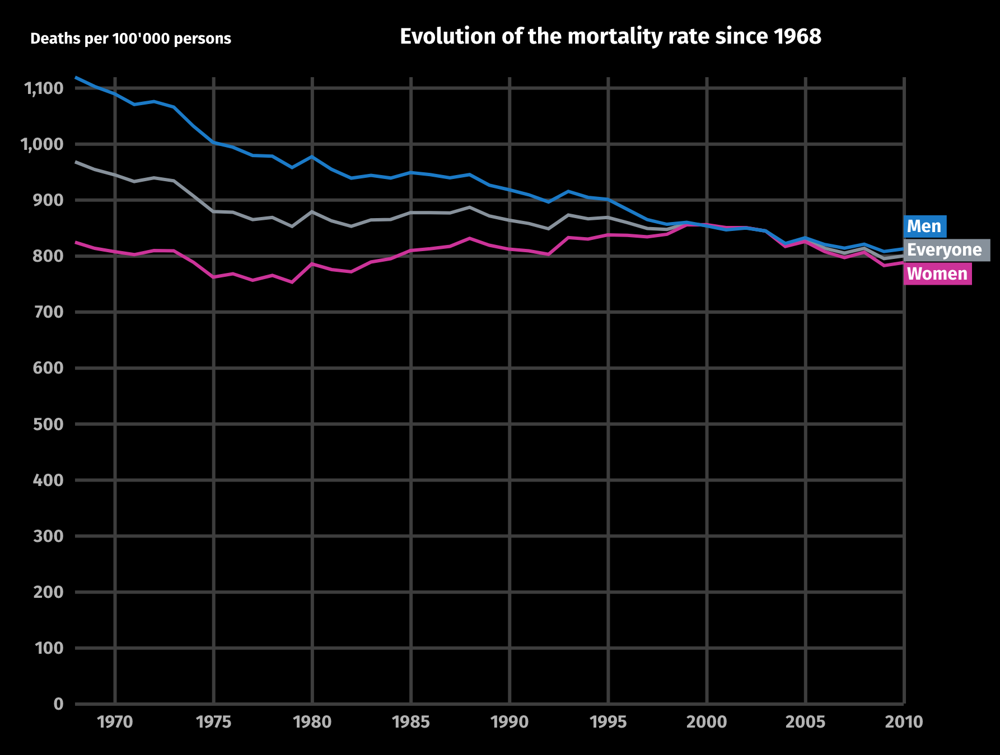
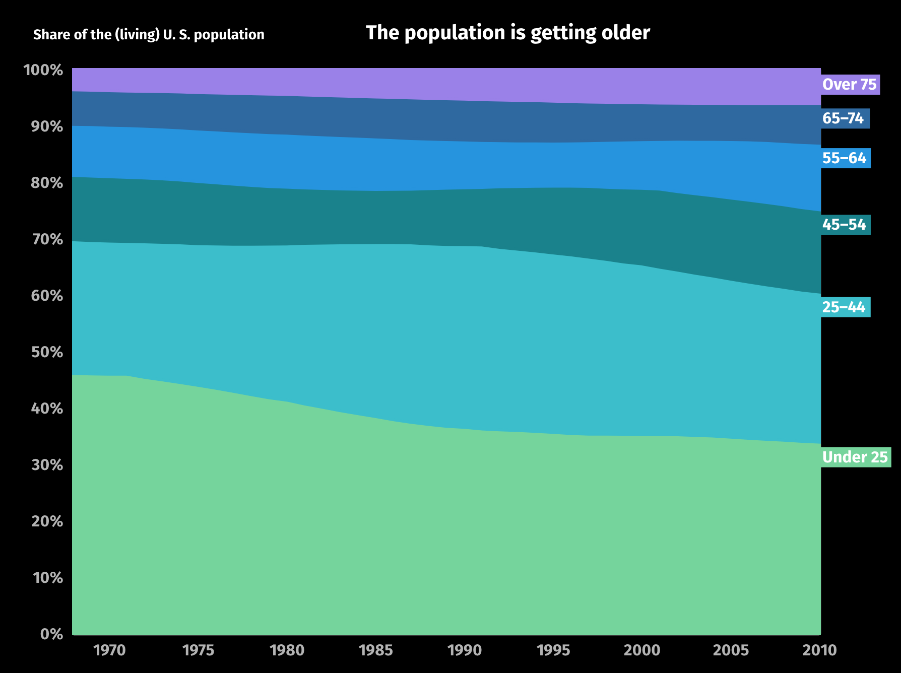
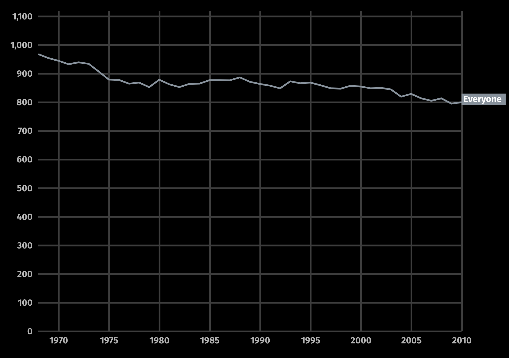

# Design-decisions
## Goal
This document outlines the reasoning process behind the design decisions of the experimental setup.

### Dimensions

The dimensions of the visualizations should be fixed. No participant will therefore see more or less details than another based on differing browser window sizes.

At the beginning of the experiment, the browser window dimensions are checked. Participants with window sizes that are not large enough to show enough content are excluded from the experiment.

As per January 2019, at least 83% of desktop website visitors worldwide have screen resolutions wider then 1280px and higher than 720px. This will therefore be the target resolution of the experiment. [^Statcounter]

[^Statcounter]: Statcounter, "Desktop Screen Resolution Stats Worldwide", http://gs.statcounter.com/screen-resolution-stats/desktop/worldwide, Accessed: 2018-01-03

## Design
The design is based on the original story that appeared on Bloomberg online.

### Terminology
* Graph
* Mark
* Axis
* Label

- [ ] Graphical explanation of the terms

### Labels
Differing from the original design, the labels have been moved next to the element that they describe. The reasoning is, that it's easier to see for the reader what is what. Yet this came with it's own set of problems. Because when lines are close together, the labels overlap. Also, the labels can overlap the marks, when the text is longer than about 8 characters. The following strategies have been chosen to resolve the above mentioned problems:

Where the labels are to close together, they are distributeted vertically so as to stay readable. The order is always determined by the order of the marks (at the end point).
Where labels are too long, they may overlap the marks

### Timing of the superposed animations
The speed and the timing of the superposed animations is determined by the reader scrolling. The reasoning behind this is, that the reader controls the "reading speed". 

- [ ] Add relevant literature
- [ ] Test variant with fixed transition times

The speed of the animation (reading speed) is defined by three factors:
1. Scroll speed
2. Scroll distance
3. Easing function

The *scroll speed* depends the readers behavior and is controllable

The *scroll distance* from start to end has been determined empirically to be 400px between two graphs.

- [ ] Test other distances than 400px

The *easing function* has also been determined empirically to be a symmetric polynomial easing:

[^d3Ease]

- [ ] Test other easing functions, especially linear

### Morphing

The states of the Morphing are calculated by interpolating between marks of the two graphs. The color-interpolation method is based on HCL-values.
[^d3Interpolate]

The reason to use HCL-interpolation is, that it's perceptually uniform. [^HCLWikipedia] Therefore it intuitively "looks right".

- [ ] Show examples with different color transformations to illustrate the above point

The axes are also interpolated and shown. The reasoning for this transition is, that it shows that the axes change. One difficulty with this approach is, that the intermediate states of the axes have no meaning. So there might be a better method.

Bloomberg collapses the axes.

- [ ] Try transitioning the axes over black

### Evolution of age groups

The original version only shows the top three age groups (75+, 65-74 and 55-64). Because the experiment will relate the visualizations more strongly to each other than the Bloomberg story, we have decided to display the same age groups in this graphic as in the succeeding visualization.

- [ ] Add 84+ age group

### Staged transitions
Already the first very informal tests have show, that it is very hard for readers to determine the origin of a transition. An example is the transition from the "Everyone"-mark to the demographics chart:

The readers often missatributed the origin to be "Men". Even more so because the text talks about the improved survival prospects of men in particular.

We therefore decided to introduce staged transitions for "one-to-many* situations. (a "granularity transition" per [^Hullman 13])

### Variable scrolling speed
Scrolling configurations can differ wildly. And some people even scroll with assistive technology or the keyboard.

### Axes

Compared to the Bloomberg version, the y-axes consequently start at 0. It is quite well reasearched, that readers easily miss it when axes don't start at 0 and get the wrong impression of the data.

- [ ] Get sources on that

### Text
The same text has been used as in the Bloomberg version of the article. Axis labels and Graph descriptions have been added though.

- [ ] What text to use?

### Informal test of superposed transition

Test subject: Simon Marcin
Tag: test_1
Scenario: Superposed
Date: 14.01.2019

The transition between "Mortality Everyone" and demographics over time is not clear. The reader didn't understand that the second graph showed in a way the composition of the line "Mortality Everyone". A proposed improvement was to show labels longer during transitions.

### Informal test of static and superposed scenarios

Test subject: Simon Schubiger
Tag: test_2
Scenario: Static and Superposed
Date: 15.01.2019

The relationship between "Mortality Everyone" and demographics over time was not clear in both scenarios. The reader suspected that it was because the transition between "Deaths per 100'000" and the stacked area percentage chart was conceptually difficult. The proposition was to include an intermediary step. For example by moving the line "Mortality Everyone" to the top (representing 100%) and then extending it downwards.

It was also mentioned that the decomposition of Mortality into Demographics is not precise. Because the Mortality is actually composed by demographics and the respective mortality by age group.

## Speed

The animations need to be fast enough to feel fluid to the reader. Otherwise unintended perceptual effects may interfere with the measuremenents. We aim therefore at a refresh rate 30 frames per second.

* The scroll event fires about avery 20ms, when it is empty
* The event still fires about every 40ms, when there is work

Implemented scroll listener not based on `onScroll`-event but based on `requestAnimationFrame`. This fires a bit more often and still makes sure that the Browser is not blocked by to many requests to redraw.

- [ ]  A few more numbers on performance

See [[Javascript Performance]] for more info.

The performance optimization also removed the third-party interpolate-path code. It took about 5ms to run on each draw call without any real use (as the morphing is now from area to area, the `d3.interpolate` function can be used)

### Informal testing
Test subjects: Till Meyer zu Westram, Moritz Meyer zu Westram, Riccarda Jegi, Andrea Zirn
Tag: test_3 (slower version) und tag_4 (faster version)
Scenario: Superposed

Both versions where presented to the subjects. They were asked which "felt" better to use.
Two subjects selected the faster version only after trying each a few times. Two subjects said that they didn't experience any difference.

We conclude that the speed improvements where perceptible but now disturbing. Still, we naturally selected the faster version.

### Informal testing
Test subjects: Jonathan Ehrengruber
Tag: test_5
Scenario: Juxtaposed animated
Date: 30.1.2019
Questionnare: Q1

The subject was shown the "demographics" experiment. He first tried to understand the relationship between the two graphs and only later started to scroll. His first attempt was to scroll with the keyboard. This jumped "over" the animation. In a second attempt the subject scrolled with the trackpad. But as his scroll speed was configured to be very high, the animation just flickered over the screen. He interpreted the flicker as an error and never got to see the animation.

Perceived the two visualizations as not related. Attention on *Men*, *Under 25*

### Informal testing
Test subjects: PH student
Tag: test_5
Scenario: Juxtaposed animated:
Date: 30.1.2019
Questionnaire: Q1

The subject was shown the "demographics" experiment. His viewport was not large enough to accomodate the two graphs completely. He scrolled very quickly and missed the transition. After an explanation, he completed the test as intended.

Perceived the visualizations as related and show "the life expectancy  and the effect it has on age of population". The attention was on "Everyone".

## Details
### Superposed
* The morphing should be very smooth and there should not be a visible redraw of the graph when arriving at a final state
* Final state is indicated by the appearenace of labels and title
* The appeareance of the labels and the title should be smooth (because it looks better?)
* A slight overlap in the interval removes the v

## Questionnaires
### Q1
1. In your opinion, what efffect or relationship is shown in the data mini-story?
2. Which group did you pay the most attention to in this data mini-story?
3. Overall, was this data mini-story shown in a visuallly nice way?

## Sources
[^Bloomberg]: Matthew C. Klein, "How Americans Die", Bloomberg Visual Data, 2014-04-17 "
[^CDCP]: Centers for Disease Control and Prevention, National Center for Health Statistics. Compressed Mortality File 1968-1978. CDC WONDER Online Database, compiled from Compressed Mortality File CMF 1968-1988, Series 20, No. 2A, 2000. Accessed at http://wonder.cdc.gov/cmf-icd8.html on Jan 7, 2019 8:28:10 AM
[^d3Ease]: [GitHub - d3/d3-ease: Easing functions for smooth animation.](https://github.com/d3/d3-ease)
[^d3Interpolate]: [GitHub - d3/d3-interpolate: Interpolate numbers, colors, strings, arrays, objects, whatever!](https://github.com/d3/d3-interpolate)
[^HclWikipedia]: [HCL color space - Wikipedia](https://en.wikipedia.org/wiki/HCL_color_space)
[^Hullman 13]: Jessica Hullman, Steven M. Drucker, Nathalie Henry Riche, Bongshin Lee, Danyel Fisher, and Eytan Adar. 2013. A Deeper Understanding of Sequence in Narrative Visualization. IEEE Transactions on Visualization and Computer Graphics 19, 12 (2013), 2406–2415
* [Transition Easing Comparison in v4 - bl.ocks.org](https://bl.ocks.org/d3noob/1ea51d03775b9650e8dfd03474e202fe)
* https://ourworldindata.org/why-do-women-live-longer-than-men

